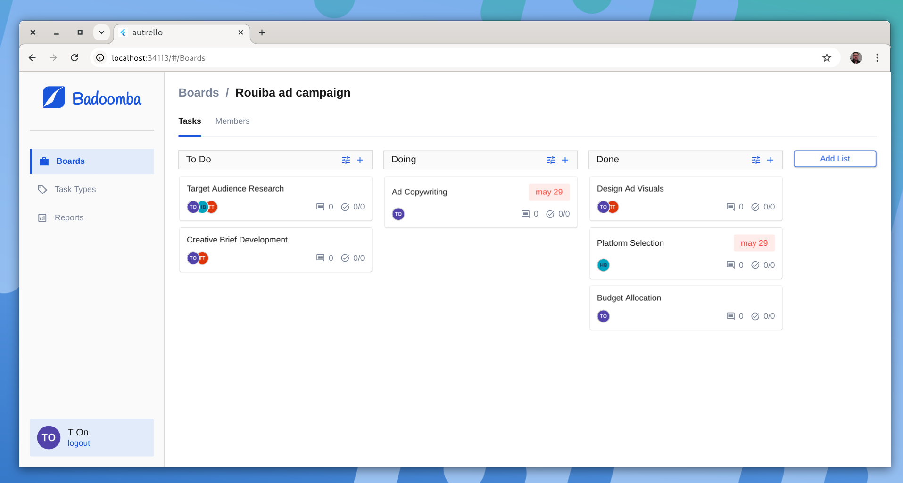
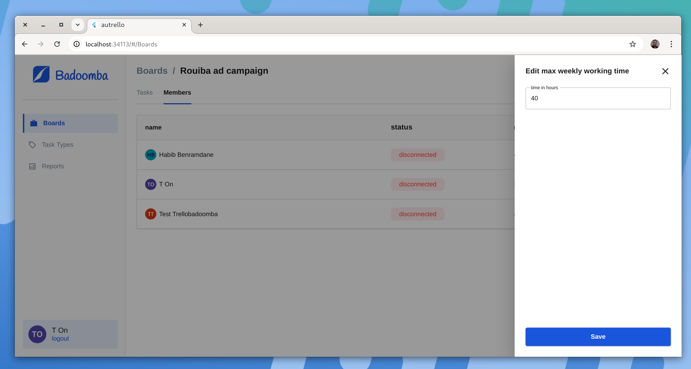

# Autrello (web):

This web application was developed to enhance Trello's functionality, tailored specifically for a manager’s workflow. The app integrates with Trello to provide real-time updates and additional custom features for managing tasks, team availability, work hours, and reporting. Built with Flutter for the frontend and Node.js for the backend, this app delivers a smooth and responsive experience with an intuitive UI.

## Features

- **Real-Time Trello Data Sync:** Integrates with Trello via API, providing real-time data synchronization. Changes made in Trello, such as task updates or new assignments, are instantly reflected in the app, keeping the UI current.
- **Max Working Hours Management:** Allows the manager to set and edit each team member’s maximum working hours (default: 40 hours/week). Tracks individual availability by calculating remaining hours based on assigned tasks.
- **Task Types with Custom Duration:** Define custom task types with specified durations. This exclusive feature allows the manager to categorize tasks for accurate workload and time estimates.
- **Task Assignment and Auto-Assignment:** View members' availability in real-time and assign tasks based on current workload. The auto-assignment feature automatically assigns tasks to the most available employee based on working hours.
- **Custom Reports with Role-Based Filtering:** Generate custom reports on work hours, task assignments, and availability, with filters for focused analysis. Reports are role-based:
- **Managers/Admins:** Access and filter reports across all tasks and team members.
        Employees: View reports related only to their assigned tasks.
- **Drag-and-Drop Task Management:** Tasks can be organized across lists using drag-and-drop functionality, similar to Trello’s interface.
- **Login with Trello Authentication:** Enables secure login using Trello’s OAuth for seamless integration and data access.

## Technical Stack
### Frontend

- Framework: Flutter (web)
- State Management: GetX
-  Real-Time Updates: WebSocket for instant updates on the frontend when webhook events are received by the backend
- UI Design: Custom UI built entirely in Flutter, with a sleek, user-friendly layout
- Authentication: Trello OAuth for secure login

### Backend

- Framework: Node.js
- Database: MySQL for robust data storage and management
- Real-Time Integration: Trello webhooks trigger backend updates, which are sent to the frontend through WebSocket connections

### Hosting

- Server: Hosted on a VPS for performance and scalability

### Technical Highlights

- WebSocket and API Integration: Combines WebSocket and Trello API integrations to ensure that any changes in Trello are instantly reflected in the app.
- Custom Data Management: Uses a flexible MySQL database to handle additional information beyond Trello, including task types, work hours, and availability tracking.
- Role-Based Filtering: Custom report filtering dynamically adapts to user roles, showing relevant data to managers/admins and restricting employee reports to their assigned tasks.

## screenshots :

